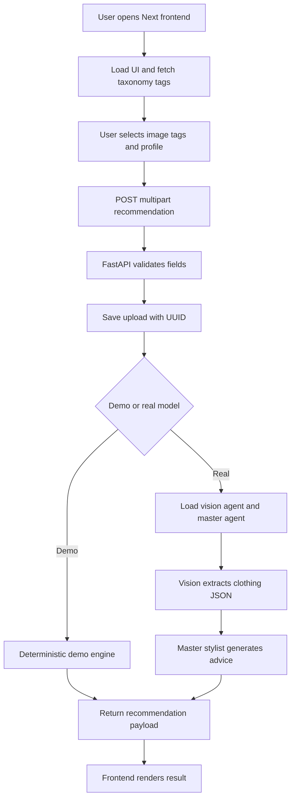

# 3D AI Stylist — Luồng thực thi và đánh giá kỹ thuật

## 1. Kết luận điều hành

Project hiện đã có một **vertical slice** từ upload ảnh đến sinh lời khuyên, nhưng chưa đạt trạng thái hệ thống doanh nghiệp ổn định. Điểm mạnh là đã phân tách frontend Next.js, backend FastAPI, vision service và master stylist service; điểm yếu lớn là tồn tại hai entrypoint backend, hai phong cách API khác nhau, model loading chưa được quản trị theo lifecycle, dữ liệu đầu vào/đầu ra chưa có schema AI chặt chẽ, và chưa có bộ đánh giá chất lượng theo ground truth.

Bản chạy local nên được xem là **prototype có khả năng trình diễn**, chưa phải production recommendation engine. Demo Mode đã giải quyết khả năng khởi động nhanh, nhưng không chứng minh chất lượng nhận biết hay chất lượng quyết định của VLM thật.

## 2. Luồng thực thi logic hiện tại



### 2.1. Startup

Frontend chạy Next.js ở `web`, thường trên port `3000`. Backend canonical chạy `backend/main.py` bằng Uvicorn ở port `8000`. Khi `AI_STYLIST_DEMO_MODE=1`, service tạo `DemoStylistEngine` và không import model nặng. Khi đặt `0`, service import `MasterStylistPipeline`; pipeline chọn `SmolVLM` mặc định hoặc `Qwen2.5-VL` nếu `VISION_MODEL_BACKEND=qwen25vl`.

Cần coi health startup và model readiness là hai trạng thái khác nhau. `/health` chỉ chứng minh process sống; nó không chứng minh model đã tải hoặc inference chạy được.

### 2.2. Request

`AIStylist.tsx` lấy tags từ `/stylist/tags`, kiểm tra ảnh và ít nhất một tag ở client, sau đó gửi `image`, `tags`, `body_type`, `skin_tone`, `hair_type`, và `face_shape` đến `/stylist/recommend/`. Router tạo profile dictionary, lưu upload, gọi engine và trả về `data.ai_reasoning_and_recommendation`.

Đây là luồng đồng bộ. Trong real mode, request đầu tiên có thể mất nhiều phút và chiếm toàn bộ worker trong lúc load model/inference. Với doanh nghiệp, nên chuyển sang job bất đồng bộ hoặc giữ model warm trong worker chuyên dụng.

## 3. Đánh giá kiến trúc

| Hạng mục | Hiện trạng | Đánh giá |
|---|---|---|
| Separation of concerns | UI, API, CV service và VLM pipeline đã tách file | Tốt ở mức prototype |
| Canonical entrypoint | Có `backend/main.py` và legacy `backend/app/main.py` | Rủi ro cao; cần chọn một contract duy nhất |
| Model lifecycle | Demo lazy; real pipeline tải model khi gọi | Chưa đủ; cần readiness, timeout, lock và resource policy |
| API contract | Multipart fields có tên cố định nhưng output model là text tự do | Chưa chuẩn doanh nghiệp |
| Data layer | SQLite mặc định, taxonomy JSON, upload filesystem | Phù hợp demo; chưa đủ versioning, audit, retention |
| Security | CORS `*`, không thấy auth/rate limit/file quota | Không production-ready |
| Observability | Có print/log cơ bản | Thiếu request ID, latency, model version, structured logs |
| Scalability | Đồng bộ trong một process | Hạn chế; cần queue/model worker hoặc inference server |
| Testability | Demo engine và mock endpoint tests | Đã cải thiện; coverage hiện 76% với legacy entrypoint chưa chạy |

## 4. Đánh giá logic doanh nghiệp

Logic hiện tại đang trộn ba lớp: **perception** nhìn ảnh, **reasoning** sinh lời khuyên, và **presentation** hiển thị văn bản. Cách này chạy được trong demo nhưng khó kiểm soát khi có khiếu nại, cần tái hiện quyết định, hoặc cần thay model.

Luồng doanh nghiệp nên là:

```mermaid
flowchart LR
  I[Image intake] --> V[Input validation]
  V --> S[Secure object storage]
  S --> P[Perception model]
  P --> X[Typed attributes and confidence]
  X --> Q[Schema and policy validation]
  Q --> R[Recommendation policy engine]
  R --> E[Explainable recommendation]
  E --> F[Feedback and audit record]
  F --> M[Evaluation dataset]
  M --> T[Model and prompt improvement]
```



| Lớp doanh nghiệp | Điều cần có | Hiện trạng |
|---|---|---|
| Intake | MIME validation, size limit, virus scan, consent | Chưa đầy đủ |
| Identity | User/session ownership and authorization | Chưa thể hiện trong flow chính |
| Catalog | Taxonomy/version, attribute definitions | Có JSON nhưng chưa versioned |
| Decision | Rules for occasion, body/profile, wardrobe constraints | Chủ yếu nằm trong prompt |
| Audit | Model ID, prompt version, input hash, output, feedback | Chưa có |
| Human override | Cho phép sửa attributes và recommendation | Chưa có |
| Privacy | Retention/deletion and sensitive attribute policy | Upload còn có thể giữ lại |
| Reliability | Retry, timeout, circuit breaker, queue | Chưa có |

## 5. Đánh giá AI: nhận biết, data, tư duy và quyết đoán

### 5.1. Khả năng nhận biết

VLM lớn như Qwen2.5-VL-7B có tiềm năng tốt hơn model nhỏ ở mô tả vật thể, chi tiết chất liệu, màu sắc, bố cục và đọc ngữ cảnh hình ảnh. Tuy nhiên, chất lượng thực tế phụ thuộc mạnh vào độ phân giải, ánh sáng, góc chụp, ảnh người mẫu hay ảnh sản phẩm, occlusion và prompt. `min_pixels`/`max_pixels` là nút điều chỉnh trực tiếp giữa chi tiết và VRAM/latency.

Không nên coi các thuộc tính như body type, skin tone, face shape hoặc độ sang trọng là sự thật khách quan từ một ảnh đơn. Đây là thuộc tính có tính chủ quan và nhạy cảm. Hệ thống cần cho phép `unknown`, trả confidence và hiển thị câu hỏi xác nhận khi confidence thấp.

### 5.2. Chất lượng data

Taxonomy hiện được đọc từ JSON và tags được flatten, unique, sort. Cách này phù hợp lookup nhưng chưa đủ cho catalog production vì thiếu ID ổn định, version, owner, effective date, synonym, locale, và trạng thái active/inactive.

Bộ ảnh trong project có thể giúp smoke test/training, nhưng chưa phải evaluation set. Muốn đo chất lượng cần chia rõ train/validation/test, tránh leakage theo cùng một sản phẩm hoặc người mẫu, gắn nhãn bởi reviewer, và lưu provenance.

### 5.3. Khả năng tư duy

Master Stylist hiện nhận visual description, profile và selected tags rồi sinh lời khuyên bằng ngôn ngữ tự nhiên. Đây là reasoning theo prompt, không phải bảo đảm suy luận đúng. Model có thể đưa lời khuyên nghe hợp lý nhưng sai thuộc tính đầu vào, bỏ qua ràng buộc, hoặc tự bịa chi tiết.

Cần tách reasoning nội bộ khỏi output người dùng. Không nên yêu cầu hoặc lưu chain-of-thought đầy đủ. Thay vào đó, trả về các lý do có thể kiểm chứng: thuộc tính đầu vào, rule đã áp dụng, trade-off, confidence và cảnh báo.

### 5.4. Độ chuẩn của quyết đoán

Chưa thể kết luận độ chính xác của quyết định chỉ từ vài demo. Cần một rubric đánh giá độc lập:

| Thành phần | Chỉ số đề xuất |
|---|---|
| Clothing recognition | Accuracy/F1 theo category, color, material, style |
| Structured extraction | JSON validity rate, schema pass rate, field-level accuracy |
| Profile estimation | Agreement với reviewer; báo cáo riêng theo nhóm và confidence |
| Recommendation | Human score về phù hợp context, phối màu, tính khả thi và nhất quán |
| Safety/fairness | Tỷ lệ overclaim, stereotype, unsupported attribute và abstention |
| System quality | p50/p95 latency, error rate, VRAM, cost/request |

## 6. Qwen2.5-VL-7B integration

Adapter mới nằm ở `ai_training/qwen_vl_adapter.py`. Cấu hình bằng `VISION_MODEL_BACKEND=qwen25vl` và `AI_STYLIST_DEMO_MODE=0`. Adapter dùng model ID, `AutoProcessor`, `Qwen2_5_VLForConditionalGeneration`, `qwen-vl-utils`, `device_map`, và giới hạn pixel có thể chỉnh qua environment.

Qwen2.5-VL-7B không nên tải trong test hoặc khi import health endpoint. Model cần được warm-up trong một worker kiểm soát được, có timeout và memory guard. Với GPU nhỏ, bắt đầu bằng `max_pixels` thấp, `torch_dtype=auto`, không bật Flash Attention cho đến khi xác minh compatibility.

Nguồn chính thức: [Qwen2.5-VL-7B-Instruct model card](https://huggingface.co/Qwen/Qwen2.5-VL-7B-Instruct) và [Transformers Qwen2.5-VL documentation](https://huggingface.co/docs/transformers/en/model_doc/qwen2_5_vl). Model card khuyến nghị kiểm soát `min_pixels`/`max_pixels` để cân bằng chất lượng và chi phí, đồng thời mô tả cách dùng `AutoProcessor` và visual inputs. [1] [2]

## 7. Coverage và độ ổn định hiện tại

Lệnh coverage đã chạy thành công:

```powershell
cd backend
python -m pytest --cov=app --cov-report=term-missing --cov-report=html:htmlcov --cov-report=xml:coverage.xml -q tests
```

Kết quả hiện tại là **15 passed, 76% coverage**. Các module CRUD, schemas, routers và CV service đạt 96–100%. Coverage tổng bị kéo xuống bởi `app/main.py` legacy ở 0% và một phần generator/DB lifecycle chưa được test. Đây là thông tin quan trọng: không nên gọi đây là “full backend coverage”. Cần deprecate hoặc test entrypoint legacy, đồng thời bổ sung database lifecycle tests.

## 8. Ưu tiên ổn định hóa

### P0 — trước khi gọi là demo ổn định

Chọn một backend entrypoint duy nhất và đánh dấu `backend/app/main.py` là legacy hoặc chuyển các endpoint legacy vào adapter có test. Thêm `/ready` kiểm tra model state riêng với `/health`. Đặt timeout, size limit, content validation, cleanup upload và request ID.

### P1 — trước khi pilot người dùng

Đưa taxonomy vào schema có version, thêm output Pydantic cho attributes/recommendation, lưu model/prompt version, thêm confidence/unknown/abstain, và chuyển real inference sang worker/queue. Thêm auth, rate limit, structured logs và metrics.

### P2 — trước production

Tạo evaluation set có reviewer, benchmark model nhỏ và Qwen2.5-VL-7B trên cùng test set, theo dõi regression, thiết kế human review/override, privacy retention, audit record và rollback model/prompt.

## Tài liệu tham chiếu

[1]: https://huggingface.co/Qwen/Qwen2.5-VL-7B-Instruct — Qwen2.5-VL-7B-Instruct model card.
[2]: https://huggingface.co/docs/transformers/en/model_doc/qwen2_5_vl — Hugging Face Transformers Qwen2.5-VL documentation.

## 9. Cập nhật triển khai sau audit

Project hiện đã có `Qwen25VLAdapter`, integration test có điều kiện tại `backend/tests/test_qwen_integration.py`, Celery/Redis queue modules tại `backend/app/queue.py` và `backend/app/tasks.py`, endpoint status polling, `docker-compose.queue.yml`, cùng ground-truth seed và benchmark tại `evaluation/`.

Integration test thực tế đã được chạy với `RUN_QWEN_INTEGRATION=1`. Máy hiện tại có NVIDIA GeForce RTX 3050 Laptop GPU khoảng 4 GB VRAM; test đã **skip có chủ đích** vì Qwen2.5-VL-7B yêu cầu tối thiểu 8 GB VRAM trong guard test. Vì vậy chưa được phép kết luận real 7B inference đã pass trên máy này. Cần GPU phù hợp hoặc inference server bên ngoài để chạy integration test thật.

Coverage backend sau khi bổ sung queue tests đạt **95%**, với 21 tests pass và 1 GPU integration test skip. Các cảnh báo còn lại là deprecation của Starlette/httpx, Pydantic class-based config và SQLAlchemy `datetime.utcnow()`.

Queue production mode dùng `AI_STYLIST_QUEUE_MODE=celery`, Redis broker/result backend, trả HTTP 202 cùng job ID và frontend poll trạng thái. Inline mode vẫn là mặc định cho demo. Để production thực sự, vẫn cần Redis durable/TLS/auth, ownership của job, rate limit, idempotency, metrics, dead-letter handling và một GPU worker được giới hạn theo VRAM.
