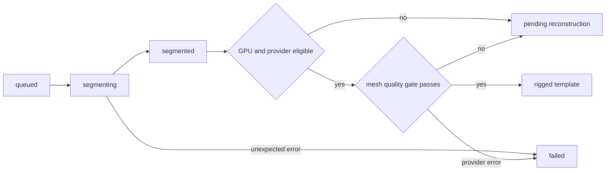

# Phase C: Asynchronous Segmentation and Rigged-Garment Reconstruction Boundary

**Author:** Manus AI  
**Status:** Implemented worker orchestration, contracts, validation, and safe local fallback. A research-grade garment reconstruction provider is intentionally **not** enabled on the current 4 GB GPU.

Phase C turns the previous synchronous-looking image-import concept into an explicit asynchronous pipeline. It preserves the working Phase B category proxy, adds a persistent state machine, runs segmentation in a dedicated queue, performs a GPU/runtime preflight before any mesh model can load, and blocks a `rigged_template` result until mesh evidence has passed an approval gate.

> A single front-facing garment photograph does not reveal hidden panels, thickness, sewing construction, material response, texture continuity, or reliable body collisions. Therefore, the pipeline never describes `canonical_proxy`, `alpha_fallback`, or `pending_reconstruction` as a physically reconstructed garment.

## Delivered architecture

| Layer | Delivered responsibility | Non-claim / boundary |
|---|---|---|
| Import API | Validates JPEG, PNG, and WEBP extension, MIME, decoded bytes, 10 MB size, 20 MP dimensions, and category override. Persists a SHA-256-backed manifest. | Filename category inference is not visual AI. |
| Manifest | Stores source image, hash, selected catalog template, skeleton, rest pose, segmentation artifact, job state, quality gate, provider version, and error reason. | Manifest persistence is file-based local MVP storage, not multi-user production storage. |
| Queue | Routes `stylist.process_garment_reconstruction` to `garment_gpu`; API returns a job ID immediately. | A job ID is not proof that mesh reconstruction succeeded. |
| Segmentation | Uses `rembg` only if explicitly installed; otherwise writes an RGBA PNG using `alpha_fallback` and labels it `unverified`. | Alpha fallback does not isolate the garment. |
| Reconstruction | Checks CUDA and configurable VRAM threshold before calling a provider interface. | No Garment3DGen/Dress-1-to-3 runtime is installed or executed locally. |
| Quality gate | Requires asset existence, valid GLB, correct skeleton/rest pose, anchors, skin weights, scale, bounds, intersections, and approved review. | A provider output without every required evidence item remains pending. |

## API contract

| Method | Endpoint | Purpose | Key outcome |
|---|---|---|---|
| `POST` | `/phase-b/garment-imports` | Import and normalize a garment photo. | Returns persisted import manifest. |
| `GET` | `/phase-b/garment-imports/{import_id}` | Read persistent import and reconstruction state. | Returns `completed`, `queued`, `pending_reconstruction`, or `failed`. |
| `POST` | `/phase-b/garment-imports/{import_id}/reconstruct` | Submit the Phase C job. | Returns `queued` and `job_id`, or `404`, `409`, `503`. |
| `GET` | `/phase-b/garment-reconstruction-jobs/{job_id}` | Poll broker/result state. | Returns Celery state and successful result payload. |
| `POST` | `/phase-b/try-on-bindings` | Retrieve skeleton-compatible preview bindings. | Continues to return category proxy bindings until a viewer supports a validated GLB asset. |

Four exported Draft 2020-12 schemas are generated by `backend/scripts/export_phase_c_schemas.py`:

| Artifact | Contract |
|---|---|
| `backend/contracts/phase_c_garment_import_manifest_v1.schema.json` | Persistent input/output and state model. |
| `backend/contracts/phase_c_segmentation_artifact_v1.schema.json` | Provider, transparent artifact, and mask-quality contract. |
| `backend/contracts/phase_c_mesh_quality_gate_v1.schema.json` | Required evidence before rigged publication. |
| `backend/contracts/phase_c_reconstruction_start_response_v1.schema.json` | Queue-submission response. |

## State machine and quality gate

The worker changes a manifest through `queued` → `segmenting` → `segmented`. It then invokes preflight and the reconstruction provider boundary. Insufficient local capability results in `pending_reconstruction`, while unexpected segmentation/provider errors produce `failed`. Only a provider returning all approved quality evidence produces `rigged_template`.



The gate is intentionally strict:

| Required evidence | Why it is mandatory |
|---|---|
| Output asset exists and GLB is valid | Prevents a logical URI from being shown as a 3D result. |
| `mixamo-humanoid-v1` and compatible rest pose | Prevents a garment from being bound to an incompatible avatar skeleton. |
| Anchors and valid skin weights | Establishes the minimum contract for skeletal attachment. |
| Scale and bounds valid | Avoids grossly mis-scaled or displaced clothing. |
| Intersection check passed | Does not replace cloth simulation, but blocks known invalid output. |
| Human review approved | Keeps uncertain generative output out of final try-on rendering. |

## Local startup

Open three PowerShell terminals from the repository root.

```powershell
# 1. Redis broker and result backend
cd "D:\Study\Studio Project\3d-ai-stylist"
docker compose -f docker-compose.queue.yml up -d

# 2. Worker dedicated to the heavy garment queue
.\run-queue.ps1 -Role gpu-worker

# 3. FastAPI application
.\run-queue.ps1 -Role api
```

Set `GARMENT_RECONSTRUCTION_MIN_VRAM_GB` only after selecting, licensing, installing, and benchmark-testing an actual provider. The default is 12 GB. Do not lower it merely to force a research reconstruction model onto an unsupported device.

## Validated local result

The local smoke test reached Redis, routed a real import through the `garment_gpu` worker, stored an `alpha_fallback` segmentation PNG, and completed the Celery task with `pending_reconstruction`. The tested environment reported **NVIDIA GeForce RTX 3050 Laptop GPU** with **4.0 GB VRAM**, below the configured 12.0 GB threshold. This is the desired safe result: no heavyweight reconstruction model was loaded and no false rigged asset was claimed.

## Current viewer limitation

The existing `BodyAvatar3D` still renders category primitives for Phase B bindings. It does not yet load a generated garment GLB, retarget an approved garment skeleton to Xbot, validate textures at runtime, or simulate collisions. Consequently, the API/worker is ready for a future provider, but the UI remains a truthful canonical-proxy preview until the GLB asset-loading and retargeting path is implemented.

## Verification record

| Check | Result |
|---|---|
| Python compile | Passed. |
| Backend test suite | `62 passed, 1 skipped`. |
| Backend coverage | `95%` total with XML report at `backend/coverage.xml`. |
| Redis reachability | Confirmed on `127.0.0.1:6379`. |
| Dedicated queue worker | Confirmed consuming `garment_gpu`. |
| API and worker smoke job | Confirmed `pending_reconstruction` transition with explicit 4 GB VRAM reason. |
| Mermaid Phase C flow | Rendered successfully as `docs/data-flow-phase-c.png`. |

## Research-provider due diligence

Use a separately provisioned and licensed offline provider only after matching its Python, CUDA, PyTorch, native-extension, VRAM, asset-license, and commercial-use requirements. Garment3DGen presents a research implementation and its documented setup depends on a specific older CUDA/Python/PyTorch/native-rendering stack rather than the local Python 3.14 environment.[1] SMPL-X and SMPLify-X licensing must also be reviewed before commercial default integration.[2] [3]

## References

[1]: https://github.com/nsarafianos/Garment3DGen "Garment3DGen repository"
[2]: https://smpl-x.is.tue.mpg.de/ "SMPL-X licensing and project site"
[3]: https://github.com/vchoutas/smplify-x "SMPLify-X repository"
