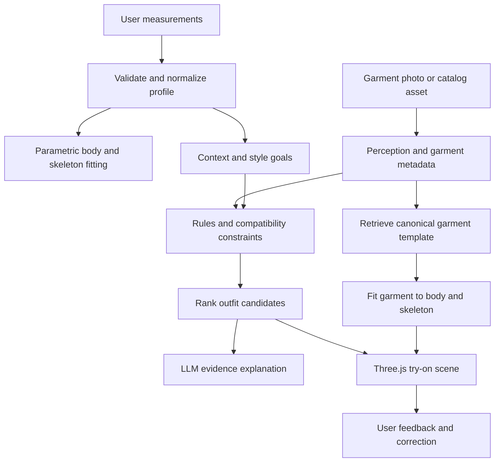

# 3D AI Stylist — Virtual Try-On Target Architecture

## Executive conclusion

The requested product is not only an image classifier or chatbot. It is a **measurement-aware, inventory-aware, explainable virtual try-on system** with four separate responsibilities: body representation, garment representation, outfit decision, and visual rendering.

The current project already has a useful frontend/backend vertical slice, a GLB viewer, measurement input, a VLM adapter, a recommendation API, Celery integration, and evaluation scaffolding. It does not yet have a production-quality parametric human model, category-specific garment meshes, rigged clothing, cloth fitting, or a validated fashion knowledge/evaluation set. The correct strategy is staged delivery rather than trying to infer a fully accurate 3D garment from one flat photo in a synchronous request.

## Target execution flow



## Data model

Store raw user measurements as sensitive input and keep derived avatar parameters separate. Do not let an LLM directly mutate mesh vertices or choose an outfit without constraints.

| Domain | Required fields | Purpose |
|---|---|---|
| Body profile | height, weight, shoulder, bust, waist, hip, inseam | Numeric body input with units and validation |
| Special features | shoulder_slope, chest_profile, leg_alignment | User-declared styling considerations; not medical claims |
| Derived body | avatar_model, shape_params, bone_lengths, calibration_version | Reproducible avatar fitting |
| Garment asset | category, subcategory, color, material, silhouette, size, texture, template_id | Searchable garment representation |
| Garment geometry | glb_uri, skeleton_id, anchors, rest_pose, bounds, simulation_profile | Render/fitting contract |
| Context | occasion, climate, modesty, movement, budget, preferred styles | Situation-aware styling |
| Decision | candidate_ids, constraints, evidence, confidence, abstentions, model_version | Auditable recommendation |

## AI decision architecture

The VLM should perform perception: category, color, pattern, material, silhouette, visible fit, and uncertainty. A catalog normalizer should convert free text to a controlled taxonomy. A deterministic compatibility engine should reject impossible or undesirable combinations, such as incompatible garment layers, missing required pieces, inappropriate occasion, unavailable sizes, or contradictory user constraints. A ranker should score the remaining outfits using style, context, proportions, color, inventory, and user preferences. The language model should explain the selected candidates using evidence and disclose uncertainty; it must not expose private chain-of-thought or make medical/body-worth judgments.

A suitable decision record is:

```json
{
  "outfit_id": "outfit_102",
  "items": ["shirt_12", "trouser_08", "belt_03"],
  "constraints_satisfied": ["business_casual", "elongate_leg_line"],
  "evidence": ["high_waist", "vertical_seam", "structured_shoulder"],
  "tradeoffs": ["less relaxed than wide-leg alternative"],
  "confidence": 0.78,
  "needs_user_confirmation": ["preferred_fit_looseness"]
}
```

## 3D body and joints

Xbot is suitable as a viewer/demo skeleton but not as the long-term body representation for measurement-driven apparel fitting. The target body should have a stable skeleton with hips, spine, chest, neck, clavicles, upper/lower arms, hands, upper/lower legs, feet, and optional face/hand joints. Height and circumferences should calibrate shape parameters; limb lengths should calibrate bone lengths; pose should use joint rotations; chest/hip/waist should use blend shapes or calibrated vertex deformation. Use collision-aware garment fitting and preserve a neutral rest pose.

SMPL-X is a strong research reference because it includes body, hands, face, pose, and shape, but its repository explicitly states a non-commercial scientific-research license. Commercial use requires a licensing review. A commercial product should use a properly licensed model or a custom parametric avatar with equivalent joint/shape contracts.

## Garment digitization strategy

A single flat image cannot reliably determine hidden garment geometry, back panels, thickness, construction, or physical parameters. Use three levels:

| Level | Input | Output | Recommended use |
|---|---|---|---|
| Catalog template | Photo plus category/size metadata | Rigged canonical GLB with texture | Production MVP |
| Assisted digitization | Photo, mask, category, optional dimensions | Template-selected GLB with material/texture transfer | User wardrobe import |
| Research reconstruction | Single image to sewing pattern/multi-view/mesh | Simulation-ready garment candidate | Offline/manual review, not request-time |

Garment3DGen is a credible research candidate for image-guided garment geometry/texture stylization, but its setup requires CUDA, nvdiffrast, PyTorch3D, CLIP/Fashion-CLIP, target meshes, and a research workflow. Dress-1-to-3 is a stronger simulation-ready research direction but is not a lightweight drop-in service. Both should run as offline workers with quality gates. For belts and simple accessories, category-specific procedural templates are more reliable than generic image-to-3D.

## Repository/model recommendation

| Candidate | Recommendation | Limitation |
|---|---|---|
| Current Xbot GLB | Keep for UI/demo while building contracts | Not a calibrated apparel avatar; clothing is not truly fitted |
| Garment3DGen | Investigate as offline garment asset worker | Heavy research dependencies and mesh prerequisites |
| Dress-1-to-3 | Research benchmark/high-fidelity future track | Heavy reconstruction and differentiable simulation pipeline |
| SMPL-X/SMPLify-X | Use as research reference or licensed server-side module | Non-commercial research license stated in repository |
| CLOTH3D | Use for research/evaluation if access/license permits | Dataset, not runtime inference |

## Enterprise quality gates

Do not measure success by fluent text alone. Require the recommendation to cite normalized garment IDs, constraints, user context, and confidence. Create human-reviewed cases covering body proportions, special features, occasions, climate, cultural/modesty preferences, missing inventory, ambiguous images, and conflicting goals. Score perception accuracy, outfit compatibility, evidence completeness, abstention correctness, user usefulness, and visual fit separately.

For 3D, add geometry checks: skeleton compatibility, garment-body intersection rate, anchor alignment, scale error, texture orientation, and frame rate. Reject or label an asset when the model lacks back-view evidence, has excessive intersections, or cannot be fitted to the target skeleton.

## Delivery roadmap

### Phase A — Product foundation

Keep the measurement UI and Three.js viewer. Replace raw heuristic labels with a versioned `BodyProfile` and `GarmentCatalog` contract. Add user correction and save/delete controls. Implement deterministic outfit rules and a small curated catalog of rigged tops, bottoms, dresses, shoes, and belts.

### Phase B — Real try-on MVP

Adopt a licensed parametric body/skeleton. Build a garment fitting service that maps each canonical garment to the body shape, applies pose, validates collisions, and returns a GLB scene. Add garment photo import that creates metadata and selects a template, rather than claiming unrestricted image-to-3D.

### Phase C — Offline AI digitization

Add a Celery GPU queue for Garment3DGen or a comparable research model. Require human/automated quality review before an imported garment enters the user wardrobe. Store model version, prompt, input image hash, generated mesh hash, license metadata, and approval status.

### Phase D — Decision intelligence

Add retrieval over the catalog, explicit compatibility scoring, user preference learning, and benchmark regression. Use the VLM for perception and explanation, not unconstrained final authority. Calibrate confidence and abstain on missing or contradictory evidence.

### Phase E — Production hardening

Add auth, tenant isolation, encrypted object storage, retention/deletion, GPU worker limits, idempotency, retries, dead-letter handling, observability, model/prompt versioning, audit events, human override, and rollback.

## References

[1]: https://github.com/nsarafianos/Garment3DGen "Garment3DGen repository"
[2]: https://dress-1-to-3.github.io/ "Dress-1-to-3 project page"
[3]: https://smpl-x.is.tue.mpg.de/ "Official SMPL-X project page"
[4]: https://github.com/vchoutas/smplify-x "SMPLify-X repository and license"
[5]: https://hbertiche.github.io/CLOTH3D/ "CLOTH3D dataset project page"
[6]: https://threejs.org/docs/pages/GLTFLoader.html "Three.js GLTFLoader documentation"
