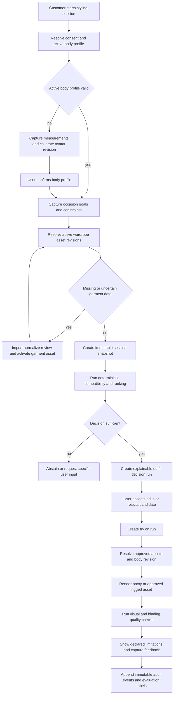

# Audit Workflow và Blueprint Nghiệp vụ Mục tiêu

**Tác giả:** Manus AI  
**Phạm vi:** 3D AI Stylist, sau Phase C  
**Đánh giá:** Hệ thống hiện hữu là một tập hợp các *technical vertical slices* tốt cho demo, nhưng **chưa phải workflow nghiệp vụ thống nhất**. Những endpoint hiện có trả lời được từng thao tác riêng lẻ, chưa quản trị được toàn bộ vòng đời: người dùng → hồ sơ cơ thể → tủ đồ → ngữ cảnh mặc → quyết định phối đồ → thử đồ 3D → phản hồi → học/kiểm định.

> Vấn đề chính không phải thiếu thêm model AI. Vấn đề là thiếu **business aggregate**, thiếu trạng thái liên kết giữa các bước, thiếu quyết định có thể truy vết, và thiếu các quality gate trước khi một kết quả AI/3D được coi là đủ tin cậy.

## 1. Chẩn đoán chính xác hiện trạng

| Lớp | Hiện có | Điểm chưa đạt chuẩn nghiệp vụ |
|---|---|---|
| Người dùng và tủ đồ | `User`, `WardrobeItem` CRUD tối giản. | Không có tenant/session, ownership xuyên suốt, vòng đời item, kích cỡ, provenance, quyền riêng tư hoặc xoá dữ liệu. |
| Hồ sơ cơ thể | Body contract được tạo từ lần gọi API. | Không có `BodyProfile` được lưu versioned, trạng thái calibration hay sự đồng ý của người dùng; không phân biệt dữ liệu gốc với mô hình avatar đã chấp thuận. |
| Garment import | Manifest ảnh, template và reconstruction job đã tồn tại. | Tách khỏi `WardrobeItem`; chưa có lifecycle để ảnh import chỉ trở thành tài sản tủ đồ sau review/approval. |
| Suy luận phối đồ | Engine có ranker và evidence. | Không tồn tại `StylingSession` chứa snapshot của body, inventory, context, constraints, decision version và hành động của người dùng. |
| Try-on | Viewer Xbot và category proxy. | Không tồn tại `TryOnRun` liên kết outfit đã chọn, avatar revision, garment assets, render revision, chất lượng render, fallback và feedback. |
| AI governance | Một số model/version xuất hiện ở task/manifest. | Không có `InferenceRun` thống nhất để biết model/prompt/catalog/rules nào tạo ra một quyết định cụ thể. |
| Vận hành | Celery task, Redis và manifest file có state. | Không có outbox/event, idempotency key, retry policy theo business state, dead-letter review, SLA, metric hoặc audit log bất biến. |

Luồng hiện tại là **request-centric**: người dùng gọi một endpoint, API xử lý, trả dữ liệu. Luồng mục tiêu cần là **case-centric**: người dùng mở một phiên tư vấn, mọi command đều thay đổi trạng thái của cùng một hồ sơ nghiệp vụ và phát ra event có truy vết.

## 2. Ranh giới domain cần thiết

Hệ thống nên được chia thành sáu bounded contexts. Chúng có thể cùng nằm trong FastAPI/SQLite ở MVP, nhưng contract và trách nhiệm phải tách ngay từ đầu.

| Bounded context | Aggregate chính | Chủ sở hữu quyết định | Dữ liệu đầu ra quan trọng |
|---|---|---|---|
| Identity and consent | `CustomerAccount`, `ConsentRecord` | Người dùng và policy | Quyền truy cập, retention, scope xử lý ảnh/số đo. |
| Body calibration | `BodyProfile`, `AvatarCalibration` | Người dùng xác nhận; calibration service đề xuất | Measurement revision, derived shape, avatar/skeleton version, confidence. |
| Wardrobe and catalog | `WardrobeAsset`, `GarmentAssetRevision` | Người dùng sở hữu; reviewer phê duyệt | Asset provenance, metadata, size, template, mesh/review state. |
| Styling intelligence | `StylingSession`, `OutfitDecisionRun` | Rule engine tạo shortlist; người dùng chọn | Context snapshot, constraints, ranked candidates, evidence, abstention. |
| Virtual try-on | `TryOnRun`, `RenderArtifact` | Renderer/quality gate; người dùng xem và phản hồi | Body revision, outfit revision, render mode, visual quality, fallback. |
| Governance and operations | `InferenceRun`, `ReviewTask`, `AuditEvent` | System/reviewer | Model/prompt/rules/catalog versions, timing, errors, decision history. |

## 3. Aggregate và state machine bắt buộc

### 3.1. Hồ sơ cơ thể

```text
DRAFT → VALIDATED → CALIBRATION_PENDING → CALIBRATED → USER_CONFIRMED → ACTIVE
                                                          ↘ NEEDS_CORRECTION
ACTIVE → SUPERSEDED → ARCHIVED
```

Mỗi `BodyProfile` phải bất biến sau khi được xác nhận. Sửa số đo phải tạo revision mới, không ghi đè. `AvatarCalibration` là output có version của thuật toán, không phải chân lý y khoa. Nếu confidence thấp hoặc input mâu thuẫn, workflow đi tới `NEEDS_CORRECTION` thay vì tự suy đoán.

### 3.2. Tài sản tủ đồ và garment import

```text
DRAFT → IMAGE_RECEIVED → VALIDATED → NORMALIZED → ENRICHED
                                              ↘ REJECTED
ENRICHED → TEMPLATE_BOUND → RECONSTRUCTION_QUEUED → QUALITY_REVIEW
QUALITY_REVIEW → APPROVED → ACTIVE_IN_WARDROBE → ARCHIVED
QUALITY_REVIEW → REWORK_REQUIRED / REJECTED
```

`WardrobeAsset` là entity người dùng nhìn thấy. `GarmentAssetRevision` giữ từng ảnh, mask, mesh, metadata, template, hash và kết quả review. Chỉ `ACTIVE_IN_WARDROBE` được tham gia outfit decision; ảnh mới import hoặc mesh chưa kiểm định không được tự động biến thành item đáng tin cậy.

### 3.3. Phiên tư vấn phối đồ

```text
DRAFT → CONTEXT_CAPTURED → INPUTS_RESOLVED → DECISION_RUNNING
     → RECOMMENDATIONS_READY → USER_REVIEWING → OUTFIT_SELECTED
     → TRY_ON_QUEUED → TRY_ON_READY → FEEDBACK_CAPTURED → CLOSED

DECISION_RUNNING → BLOCKED_NEEDS_INPUT / ABSTAINED / FAILED
```

`StylingSession` phải snapshot các revision được dùng: body profile, wardrobe inventory, climate/occasion, style goals, budget, comfort, modesty, availability và catalog/rule version. Vì thế cùng một decision có thể tái hiện và audit được sau nhiều tháng.

### 3.4. Quyết định outfit

`OutfitDecisionRun` không chỉ trả text. Nó phải lưu dữ liệu có cấu trúc gồm constraints đầu vào, candidate IDs, rejected candidates và lý do loại, score breakdown, evidence, trade-off, confidence, abstention, rules version, model/prompt version và user action. LLM chỉ chuyển evidence đã kiểm chứng thành lời giải thích; không được là authority cuối cùng để thay đổi inventory, fit hoặc geometry.

### 3.5. Try-on và render

```text
REQUESTED → ASSET_RESOLUTION → BINDING_VALIDATION → RENDER_QUEUED
          → RENDERING → QUALITY_CHECK → READY → VIEWED → RATED
QUALITY_CHECK → PROXY_FALLBACK / NEEDS_REVIEW / FAILED
```

Một `TryOnRun` phải nêu rõ nó dùng **proxy**, **canonical rigged asset**, hay **reconstructed asset approved**. `READY` không đồng nghĩa với “fit vật lý chính xác”; `render_mode`, collision status, asset quality và limitation phải được hiển thị cùng kết quả.

## 4. Workflow mục tiêu từ đầu đến cuối



## 5. Command, event và idempotency pattern

API phải nhận command có `idempotency_key`, `actor_id`, `session_id` hoặc aggregate ID. Command được validate và commit state trước; chỉ sau đó mới phát `DomainEvent` qua outbox/queue.

| Command | State thay đổi | Event phát ra | Worker bất đồng bộ |
|---|---|---|---|
| `CreateBodyProfile` | DRAFT body revision | `BodyProfileSubmitted` | Calibration. |
| `ConfirmBodyCalibration` | ACTIVE body revision | `BodyProfileActivated` | Avatar cache invalidation. |
| `ImportWardrobeAsset` | IMAGE_RECEIVED asset revision | `GarmentImportAccepted` | Perception, segmentation. |
| `ApproveGarmentRevision` | ACTIVE_IN_WARDROBE | `WardrobeAssetActivated` | Search index/catalog projection. |
| `CreateStylingSession` | CONTEXT_CAPTURED | `StylingSessionOpened` | Constraint resolution. |
| `RunOutfitDecision` | DECISION_RUNNING | `OutfitDecisionRequested` | Ranker/LLM explanation. |
| `SelectOutfitCandidate` | OUTFIT_SELECTED | `OutfitSelected` | Try-on orchestration. |
| `RequestTryOn` | TRY_ON_QUEUED | `TryOnRequested` | Binding/render/quality. |
| `SubmitFeedback` | FEEDBACK_CAPTURED | `TryOnFeedbackRecorded` | Evaluation aggregation. |

Điều này thay thế việc frontend tự ghép nhiều endpoint rời rạc mà không có transaction boundary. Một worker phải idempotent theo event/aggregate revision, không theo filename hoặc trạng thái Redis tạm thời.

## 6. Quality gates có ý nghĩa nghiệp vụ

| Gate | Quyết định được phép | Nếu không đạt |
|---|---|---|
| Input and consent | Lưu ảnh/số đo để xử lý | Từ chối hoặc yêu cầu consent/sửa input. |
| Body calibration | Dùng body revision trong decision/try-on | `NEEDS_CORRECTION`, không suy đoán. |
| Garment normalization | Cho item tham gia ranking | `PENDING_REVIEW`, không đưa vào active wardrobe. |
| Outfit constraints | Đưa candidate cho người dùng | `ABSTAINED`/`BLOCKED_NEEDS_INPUT`, nêu rõ thiếu gì. |
| 3D asset quality | Dùng GLB rigged trong try-on | Proxy fallback hoặc review. |
| Render quality | Hiển thị một try-on là usable | Nhãn limitation, retry hoặc failure. |
| Human feedback | Dùng vào evaluation/training | Không dùng phản hồi mơ hồ làm ground truth tự động. |

## 7. AI governance và phương pháp khoa học

AI cần đóng vai trò theo từng nhiệm vụ có thể đo riêng, không phải “AI hiểu thời trang” như một hộp đen:

| AI task | Input | Output bắt buộc | Đánh giá |
|---|---|---|---|
| Perception | Ảnh garment | Typed attributes, evidence, confidence, `unknown` | Field-level accuracy, calibration, schema validity. |
| Normalization | Attributes + taxonomy | Canonical category/style/material IDs | Mapping accuracy, reviewer agreement. |
| Outfit ranking | Snapshot body, wardrobe, context, constraints | Ordered candidates + score components | Constraint satisfaction, human preference, abstention correctness. |
| Explanation | Verified decision record | Bản giải thích ngắn, trade-off, limitation | Evidence faithfulness, unsupported-claim rate. |
| 3D reconstruction | Asset revision + mask/template | Candidate mesh plus quality evidence | Skeleton/bounds/intersection/texture and reviewer approval. |

Cần tách **offline evaluation** khỏi inference runtime. Ground truth phải có provenance, reviewer, rubric, data split và version. Không dùng output AI để tự xác nhận output AI.

## 8. Khác biệt quan trọng với kiến trúc hiện hữu

| Hiện tại | Mục tiêu chuẩn hơn |
|---|---|
| Endpoint lấy dữ liệu và xử lý ngay. | Command thay đổi aggregate; event kích hoạt worker có idempotency. |
| Body contract và outfit decision độc lập. | Cả hai gắn với immutable `StylingSession` snapshot. |
| Import manifest nằm ngoài wardrobe CRUD. | Garment revision đi qua lifecycle trước khi thành active wardrobe item. |
| Queue chỉ có job state kỹ thuật. | Job state gắn với business state, SLA, owner, retry/review và audit event. |
| AI trả recommendation/text. | Decision record có constraints, score, evidence, versions và user action. |
| 3D viewer render category proxy. | Try-on run công bố render mode và quality/limitation rõ ràng. |
| Test endpoint đơn lẻ. | Test state transition, idempotency, invariant, event contract và end-to-end case. |

## 9. Backlog triển khai theo thứ tự khoa học

### P0 — Workflow foundation

1. Tạo schema/database cho `BodyProfileRevision`, `WardrobeAsset`, `GarmentAssetRevision`, `StylingSession`, `OutfitDecisionRun`, `TryOnRun`, `AuditEvent` và `ReviewTask`.
2. Thêm `actor_id`, `idempotency_key`, version, status, timestamps và correlation ID vào mọi command.
3. Thay `POST /phase-a/outfit-decisions` rời rạc bằng command tạo/running `StylingSession`; vẫn có adapter để không phá demo UI.
4. Liên kết Phase B garment manifest với wardrobe asset revision; cấm asset chưa approved tham gia decision chính thức.
5. Tạo deterministic state-transition service và test invariants; queue chỉ nhận events đã commit.

### P1 — Intelligence có kiểm soát

1. Thêm garment attribute normalization, unknown/confidence và review task.
2. Tạo constraint model đầy đủ cho context: occasion, weather, fit, budget, modesty, mobility, color/style goals, availability.
3. Lưu score breakdown/rejected candidates/abstention trong `OutfitDecisionRun`.
4. Thêm feedback có cấu trúc: thích/không thích, fit concern, occasion mismatch, asset mismatch, visual-render issue.
5. Dùng feedback đã review để tạo evaluation set và regression benchmark.

### P2 — Try-on production path

1. Đưa canonical rigged garment asset đã review vào viewer qua asset resolver, skeleton retargeting và runtime verification.
2. Triển khai `TryOnRun` quality gate, proxy fallback, render metrics và approved reconstructed-asset path.
3. Di chuyển storage từ filesystem sang object storage có ownership, retention/delete và signed access.
4. Thêm auth, tenant isolation, rate limit, audit retention, DLQ, alerting, dashboard và rollback catalog/model/prompt.

## 10. Khuyến nghị quyết định ngay

Không nên ưu tiên cài thêm model 3D nặng vào thời điểm này. Bước có tỷ lệ giá trị/rủi ro tốt nhất là **P0 Workflow foundation**: tạo các aggregate, state machine, audit/event boundary và adapter không phá UI hiện hữu. Sau P0, mọi khả năng AI/3D mới đều có nơi hợp lệ để gắn vào, đo lường và rollback.

Khi P0 được hoàn thành, hệ thống sẽ chuyển từ “demo nhiều endpoint” sang “một hồ sơ tư vấn phối đồ có vòng đời, bằng chứng và trạng thái rõ ràng.”
